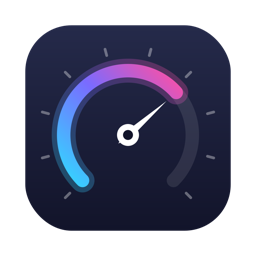
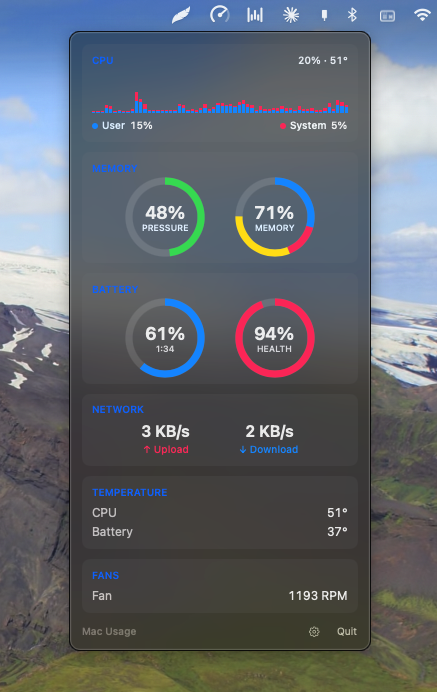
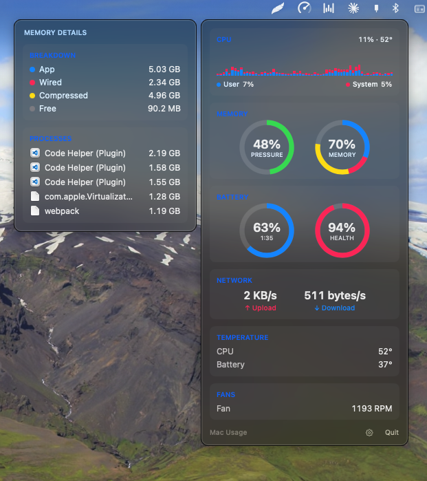
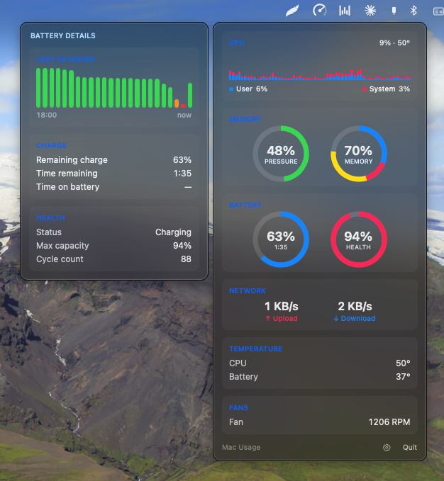
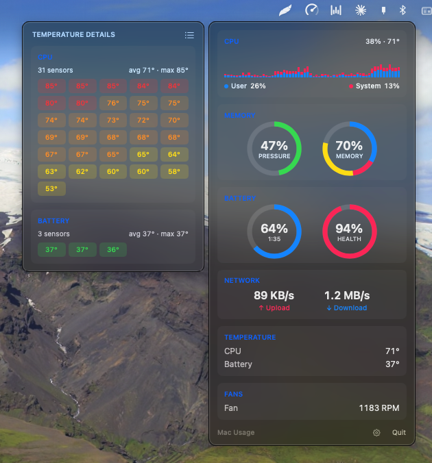
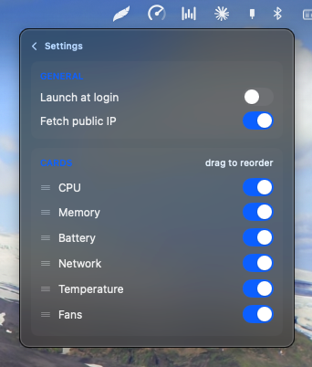

<div align="center">



# Mac Usage

**A minimal, extendable macOS menu bar system monitor — inspired by iStat Menus.**

CPU · Memory · Battery · Network · Temperature · Fans




</div>

Click the gauge icon in the menu bar and everything that matters is one
panel: live CPU history, memory pressure, battery health, network
throughput, every temperature sensor your Mac has, and fan speeds.
Hover any card for the full story.

## Highlights

- **📊 CPU** — stacked user/system history chart with the current load and
  CPU temperature in the corner. Hover: usage breakdown + the five
  hungriest processes.
- **🧠 Memory** — pressure and usage rings, iStat-style. Hover:
  App/Wired/Compressed/Free breakdown and a top-processes list that
  matches Activity Monitor's numbers (it uses the same footprint metric).
- **🔋 Battery** — level ring with time remaining, health ring. Hover: a
  24-hour level history (hover a bar for that hour), charge details,
  max capacity, and cycle count.
- **🌐 Network** — live upload/download. Hover: a five-minute activity
  chart with per-direction peaks, Wi-Fi name, local and public IPs.
- **🌡️ Temperature** — every SMC sensor on your machine, grouped and
  color-coded from cool teal to alarming red; toggle raw sensor names on
  when you want the hardware's identity.
- **🌀 Fans** — live RPM with each fan's min/max range (fanless Macs
  correctly report "No fans detected").
- **🚨 Threshold alerts** — the menu bar icon grows a red badge when CPU
  passes 90%, memory pressure 80%, CPU temperature 90°, or battery drops
  below 10% while discharging; the panel explains why.
- **⚙️ Settings** — hide cards you don't care about, drag to reorder
  them, start at login, and a privacy switch for the public-IP lookup.

<div align="center">
<table>
  <tr>
    <td align="center">
      
      <br><sub><b>Memory details</b> — breakdown + Activity-Monitor-accurate processes</sub>
    </td>
    <td align="center">
      
      <br><sub><b>Battery details</b> — 24 h history, charge, health, cycles</sub>
    </td>
  </tr>
  <tr>
    <td align="center">
      
      <br><sub><b>Temperature details</b> — all 30+ sensors, heat-mapped</sub>
    </td>
    <td align="center">
      
      <br><sub><b>Settings</b> — reorder cards by dragging, toggle what you see</sub>
    </td>
  </tr>
</table>
</div>

## Install (one command)

```bash
curl -fsSL https://raw.githubusercontent.com/ShovonCodes/mac-usage/main/bootstrap.sh | bash
```

That fetches the latest code, builds the app, wraps it into a real
`MacUsage.app` bundle, installs it into `/Applications`, and launches it.
A gauge icon appears in the menu bar; click it to open the stats panel.
Quit from the panel's Quit button.

The installer asks whether the app should start automatically at login —
press Enter for yes, or answer `n`. You can change your mind any time in
the app: gear icon → "Launch at login".

After installing:

- Spotlight finds it: ⌘Space → "Mac Usage".
- It behaves like any other installed app — no terminal needed again.

Prefer not to pipe curl into bash? Clone and run the installer yourself —
it's the same thing:

```bash
git clone https://github.com/ShovonCodes/mac-usage.git
cd mac-usage
./install.sh
```

### Requirements

- macOS 13 (Ventura) or newer
- Xcode Command Line Tools (`xcode-select --install` if you don't have
  them) — these include the Swift compiler and Swift Package Manager, so
  there is nothing else to install

No Xcode project, no dependencies — plain Swift Package Manager.

## Update

Run the install command again. It always fetches the latest code, rebuilds,
and replaces the installed app in place — there is no separate updater.

## Uninstall

```bash
curl -fsSL https://raw.githubusercontent.com/ShovonCodes/mac-usage/main/uninstall.sh | bash
```

Quits the app, deletes it, removes the login item, and clears preferences.

Manual alternative: quit the app, drag `/Applications/MacUsage.app` to the
Trash, and (if you enabled start-at-login) remove it from
System Settings → General → Login Items.

## Privacy

Everything is read locally from the kernel, IOKit, and the SMC. The app
makes exactly **one** kind of network request: the public-IP lookup for
the network panel (api.ipify.org, cached for 10 minutes, only while the
panel is open) — and the "Fetch public IP" switch in Settings turns it
off entirely. No analytics, no update pings, nothing else.

## Behavior

- Menu bar shows only an icon — all stats live in the click-to-open panel.
- Hovering a card expands a detail panel beside the main one.
- Panel open: stats refresh every **2 seconds**.
- Panel closed: a light background refresh every **15 seconds** keeps the
  data warm so the panel never opens empty.
- No Dock icon; the app lives entirely in the menu bar.
- No admin rights needed for anything — including SMC fan/temperature
  reads.

## Developing

Edit the source, then re-run `./install.sh` — it rebuilds and replaces the
installed app in one step.

To try a build *without* touching the installed copy (you'll get a second
gauge icon in the menu bar next to the installed one):

```bash
swift build -c release && .build/release/MacUsage &
```

Kill that test copy with `pkill -f '.build/release/MacUsage'` — the
installed app keeps running.

## How it works

| File | Job |
|---|---|
| `MacUsageApp.swift` | Entry point; puts the app in the menu bar |
| `StatsPanelView.swift` | The dropdown panel UI |
| `StatsStore.swift` | Owns readers + the adaptive refresh timer |
| `DetailPanelController.swift` | The hover detail panel beside the main one |
| `LoginItemManager.swift` | Start-at-login registration (SMAppService) |
| `Readers/CpuUsageReader.swift` | CPU % from kernel tick counters |
| `Readers/MemoryUsageReader.swift` | RAM usage from kernel VM statistics |
| `Readers/MemoryDetailsReader.swift` | Memory breakdown + top processes (for the hover panel) |
| `Readers/BatteryReader.swift` | Battery level, time remaining, health, cycles (IOKit) |
| `Readers/BatteryHistoryReader.swift` | 24h battery level history (power log + live samples) |
| `Readers/NetworkSpeedReader.swift` | Up/down throughput from kernel interface counters |
| `Readers/NetworkInfoReader.swift` | Wi-Fi name, local IPs, public IP (cached) |
| `Readers/SmcConnection.swift` | Low-level channel to the SMC chip (IOKit) |
| `Readers/FanAndTemperatureReader.swift` | Fan RPM + temp sensors on top of SMC |
| `Models/StatModels.swift` | Plain data structs the UI renders |

Fan and temperature data come from the SMC (System Management Controller).
Sensor key names differ across Mac models, so at startup the app scans all
available SMC keys and keeps the ones that look like CPU/GPU/battery
temperature sensors — this makes it work on both Intel and Apple Silicon
without hard-coded sensor lists. Reading the SMC needs no admin rights.

## Adding a new stat (the extension pattern)

1. Create a reader in `Sources/MacUsage/Readers/`, e.g. `DiskSpaceReader.swift`,
   with a `readCurrentUsage()`-style method returning a model struct.
2. Add the model struct to `Models/StatModels.swift`.
3. In `StatsStore.swift`: add a `@Published` property and call your reader
   inside `refreshAllStats()`.
4. In `StatsPanelView.swift`: add a `StatSectionCard` section rendering it.

Good next candidates: disk usage & I/O, Bluetooth device batteries, power
draw, per-core CPU.
